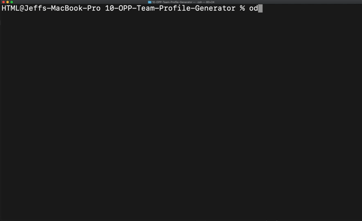

# 10-OPP-Team-Profile-Generator

This is CLI application that allows you to generate team role cards, the prompts walk the user through questions powered by inquirer. The information entered is used to popilate the html.index file. Each role has a specific color to allow for further distiction of who is in charge and who is an engineer or intern.

# Table of Contents

|                               |                         |
| ----------------------------- | ----------------------- |
| [GitHub Links](#github-links) | [Questions](#questions) |
| [Installation](#installation) | [License](#license)     |
| [Test](#test)                 | [Credits](#credits)     |
| [Usage](#usage)               |                         |
|                               |                         |

# Installation

Open terminal/gitbash and run the following:

```
  npm install
```

## Test

Once installed, open terminal/gitbash and run the following:

```
  npm test
```

## Usage

To start the CLI please run the following in terminal/gitbash:

```
  node index.js
```

## Here is a preview of README Generator!



# GitHub Links

Deployed Project [Link](https://jeffcela.github.io/10-OPP-Team-Profile-Generator/)<br>
Project Repository [Link](https://github.com/jeffcela/10-OPP-Team-Profile-Generator)

## Questions

Please direct any questions to jeffcela@gmail.com

# Contributing

Please refer to each project's style and contribution guidelines for submitting patches and additions. In general, we follow the "fork-and-pull" Git workflow.

1. Fork the repo on GitHub
2. Clone the project to your own machine
3. Commit changes to your own branch
4. Push your work back up to your fork
5. Submit a Pull request so that we can review your changes

# Credits

_This homework assignment was completed in VS Code and Terminal by Jeff Cela on the day of 09/08/2021_
© 2021 Trilogy Education Services, LLC, a 2U, Inc. brand. Confidential and Proprietary. All Rights Reserved.

# License

[](https://shields.io)
